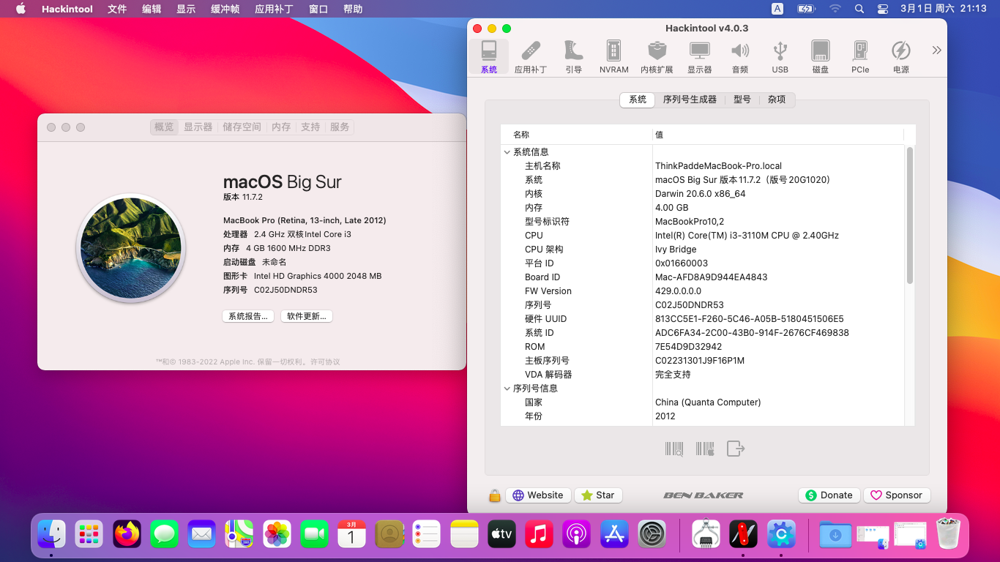

# ThinkPad-Edge-E430c-i3-3110M-BigSur-Hackintosh
应用于联想ThinkPad Edge E430c的OpenCore 1.0.3的黑苹果引导 支持macOS Big Sur 11.7

注意：此EFI不含三码 实际使用时请自行使用[OCAT](https://github.com/ic005k/OCAuxiliaryTools)生成


### 配置清单
|类型|型号|规格|
|---|---|---|
|CPU|Intel i3-3110M|2.4 GHz|
|内存|SK海力士 4GB DDR3|1600 MHz|
|硬盘|杂牌 SATA SSD|120 GB|
|显卡 1|Intel HD 4000|64-512 MB|
|显卡 2|NVIDIA GT 635M|2 GB|
|网卡|RealTek 8168|1000 Mbps|
|声卡|Conexant Cx20672|立体声|
|Wi-Fi|博通 BCM43142 MiniPCIe版|300 Mbps|
|操作系统|macOS Big Sur|11.7|
|BIOS|Phoenix UEFI|H0ET94WW(2.54)|

#### 无法工作的部分
- Wi-Fi蓝牙：需要更换"Intel Wireless-N 2230"网卡(BIOS原生支持)
- 隔空投送和接力：需要破解BIOS网卡白名单，并更换博通WI-FI网卡。
- 独显：目前无解
- VGA接口：无解
- DRM硬解：无解

#### 附注事项
- 睡眠与唤醒：未完全解决，如果出现睡死情况，可使用终端强制关闭睡眠功能：
```
sudo pmset -a sleep 0
sudo pmset -a hibernatemode 0
sudo pmset -a disablesleep 1
```
- 此EFI理论可兼容**High Sierra - Catalina**系列老版本的macOS，但目前未做进一步测试。
